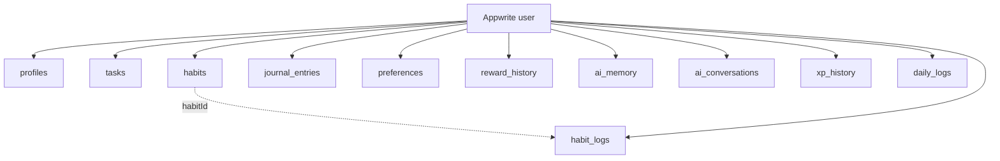

# Life Companion AI

An AI-powered personal companion that helps you build discipline through personalized motivation, rewards, memory, and habit tracking. React + Vite on the front end, Appwrite for storage, Gemini for the companion itself.

It is not a to-do app. Completing a task sends the task, your stored preferences, and your recent reward history to Gemini, which decides how to congratulate you and whether to reward you now or make you wait for it.

**This is a single-user app with no sign-in.** It opens straight on the Dashboard. See [Security model](#security-model) for what that means and when it stops being okay.

## Quick start

**Prerequisites:** Node.js 20.19+ (or 22.12+), an Appwrite project, and optionally a Gemini API key.

```bash
npm install
Copy-Item .env.example .env.local     # then fill it in — see Environment variables
npm run dev
```

The backend has to exist first. There are two ways to create it, and they produce exactly the same result:

**A. Let the script do it** — one command, ~90 attributes and every index, no clicking:

1. Create an Appwrite project and add a **Web** platform for `localhost`. Copy the project ID.
2. Create a server API key (**Overview → Integrations → API Keys**) with the `databases.read` and `databases.write` scopes.
3. Put both in `.env`, then run `npm run setup:appwrite`. It is idempotent, so re-running after a schema change only adds what is missing. Confirm with `npm run verify:appwrite`.
4. Delete `APPWRITE_API_KEY` from `.env` — the app never uses it.

**B. Build it by hand in the console** — follow [Manual setup](#manual-setup-appwrite-console). No API key needed. The script is just a transcription of that procedure, so neither path is more "correct" than the other.

Either way, finish with `npm run dev`. There is no sign-in — the app opens straight on the Dashboard and creates its own profile document on first load. Visit **Settings** to tell Aura about yourself and **Rewards** to teach it what you love; both make the companion dramatically more personal.

Checks:

```bash
npm run lint
npm run build
```

### Backend tooling

All four commands read [`src/appwrite/schema.js`](src/appwrite/schema.js), so they cannot disagree with each other or with the app:

| Command | What it does |
| --- | --- |
| `npm run setup:appwrite` | Creates/completes the database, collections, attributes, indexes, and permissions. Idempotent. Needs `APPWRITE_API_KEY`. |
| `npm run verify:appwrite` | Read-only audit of the live project against the schema. Reports missing attributes, wrong sizes, missing indexes, bad permissions. Run this first whenever the app starts erroring. |
| `npm run schema` | Prints a build checklist, for creating the collections by hand in the console. |
| `npm run schema:md` | Same checklist as markdown tables. |

## Environment variables

Copy `.env.example` to `.env.local`. Commit the example; never commit `.env.local`.

```dotenv
# Appwrite (required)
VITE_APPWRITE_ENDPOINT=https://cloud.appwrite.io/v1
VITE_APPWRITE_PROJECT_ID=your_appwrite_project_id
VITE_APPWRITE_DATABASE_ID=life_companion
VITE_APPWRITE_BUCKET_ID=uploads

# Who this app belongs to. There is no sign-in — every document is written with
# VITE_OWNER_ID as its ownerId, and every query filters on it.
VITE_OWNER_ID=solo
VITE_OWNER_NAME=Abhishek

# Gemini (optional — without a key, Aura falls back to built-in responses)
VITE_GEMINI_API_KEY=your_gemini_api_key
VITE_GEMINI_MODEL=gemini-2.0-flash

# Provisioning only — NOT bundled (no VITE_ prefix).
# Server key with databases.* scopes, used solely by `npm run setup:appwrite`.
# Not needed at all if you create the collections by hand.
APPWRITE_API_KEY=your_appwrite_server_api_key

# Optional collection-ID overrides (only if yours differ from the defaults)
# VITE_COL_PROFILES=profiles
# VITE_COL_TASKS=tasks
# ... see .env.example for the full list
```

| Variable | Required | Notes |
| --- | --- | --- |
| `VITE_APPWRITE_ENDPOINT` | yes | `https://cloud.appwrite.io/v1` for Appwrite Cloud; your own host if self-hosted (note the `/v1`). |
| `VITE_APPWRITE_PROJECT_ID` | yes | From **Overview** in the console. |
| `VITE_APPWRITE_DATABASE_ID` | yes | Must match the database ID you create. Default `life_companion`. |
| `VITE_OWNER_ID` | yes | Any stable string. Written as `ownerId` on every document. **Pick one and don't change it** — changing it later hides all existing data (it stays in the database, just filtered out). |
| `VITE_OWNER_NAME` | no | Display name used when the profile is first created. Editable later in Settings. |
| `VITE_GEMINI_API_KEY` | no | Without it the app runs fine on built-in fallback responses. |
| `VITE_GEMINI_MODEL` | no | Defaults to `gemini-2.0-flash`. |
| `VITE_APPWRITE_BUCKET_ID` | no | Reserved; nothing uploads files yet. |
| `APPWRITE_API_KEY` | no | Only for `npm run setup:appwrite`. Skip it entirely if you provision by hand. |

> **Every `VITE_*` value is bundled into the browser and is public.** `APPWRITE_API_KEY` has no `VITE_` prefix precisely so Vite will not expose it.
>
> The app calls Gemini directly from the browser, so `VITE_GEMINI_API_KEY` is visible to anyone who opens devtools. Fine for local use and a private deployment with a rate-limited key. Before shipping publicly, move the Gemini calls behind an Appwrite Function and drop the key from the bundle.

**Without a Gemini key the app still runs.** Every AI call in [`src/gemini/aiService.js`](src/gemini/aiService.js) has a local fallback, so tasks, XP, habits, journaling, and rewards all work — the companion's responses are just canned instead of generated.

## Database architecture

One Appwrite database (`life_companion` by default). Every document carries an `ownerId`, which in this single-user build is always the `VITE_OWNER_ID` constant. Keeping the field rather than dropping it means the schema, indexes, and queries need no changes if you ever add real accounts — `ownerId` simply becomes a real user ID.

There are no Appwrite relationship attributes — `habit_logs.habitId` is a plain string holding a `habits.$id`, and joins happen client-side.

The client reads and writes through [`src/appwrite/db.js`](src/appwrite/db.js). The authoritative attribute contract lives in [`src/appwrite/schema.js`](src/appwrite/schema.js), and the provisioning script mirrors it — **if you change one, change both.**



### Conventions

- **`dateKey`** is a *local* `YYYY-MM-DD` string. Using a local key rather than a UTC timestamp is deliberate: "did I do this today" has to mean the user's today, not UTC's.
- **`createdAt` / `completedAt` / `deadline`** are ISO-8601 strings.
- **`*_json` attributes** hold structured values as JSON text (Appwrite has no object type). They are (de)serialized by `parseJson` / `toJson` in `db.js`.
- **`ownerId` is the only required attribute.** The app writes partial documents — an unset age stays `null` — and Appwrite rejects `null` on required attributes. Ownership is the thing that genuinely must always be present, so it is the only thing enforced.

### Collections

| Collection | Purpose | Key fields |
| --- | --- | --- |
| `profiles` | One per user: identity, XP, level, streak, the AI-facing personal profile, cached daily briefing | `ownerId`, `xp`, `streak`, `dailyQuoteKey` |
| `tasks` | Scheduled and completed tasks | `ownerId`, `dateKey`, `completed`, `difficulty` |
| `habits` | Habit definitions and their current streaks | `ownerId`, `archived`, `lastDoneKey` |
| `habit_logs` | One row per habit per completed day | `ownerId`, `habitId`, `dateKey` |
| `journal_entries` | Daily entry, mood/energy/sleep/stress, plus Gemini's analysis | `ownerId`, `dateKey` |
| `preferences` | What the user loves, one row per category | `ownerId`, `category`, `items_json` |
| `reward_history` | Rewards Gemini has given, and why | `ownerId`, `type`, `seen` |
| `ai_memory` | Durable facts distilled from chats and journals | `ownerId`, `kind`, `weight` |
| `ai_conversations` | Chat transcript | `ownerId`, `role` |
| `xp_history` | One row per XP event | `ownerId`, `dateKey`, `amount` |
| `daily_logs` | Pre-aggregated daily metrics (reserved; stats are currently derived on the fly) | `ownerId`, `dateKey` |

### Attributes

Rather than duplicate ~90 attributes here (where they would quietly drift out of sync), the full list is **generated from the schema itself**:

```bash
npm run schema        # console-ready checklist: every attribute, type, size, default
npm run schema:md     # same thing as markdown tables
```

That reads [`src/appwrite/schema.js`](src/appwrite/schema.js) — the single source of truth. The provisioning script reads the same file, so the checklist you build from and the collections the script creates can never disagree.

### Indexes

Every collection gets a key index on `ownerId`. The provisioning script also adds the composite indexes the app's filtered queries need:

| Collection | Composite indexes |
| --- | --- |
| `tasks` | `ownerId, dateKey` · `ownerId, completed` |
| `habits` | `ownerId, archived` |
| `habit_logs` | `ownerId, dateKey` · `ownerId, habitId` · `ownerId, habitId, dateKey` |
| `journal_entries` | `ownerId, dateKey` |
| `preferences` | `ownerId, category` |
| `ai_memory` | `ownerId, weight` |
| `xp_history` | `ownerId, dateKey` |
| `daily_logs` | `ownerId, dateKey` |

## Security model

There is no authentication. Every collection is provisioned with full read/create/update/delete granted to **`Role.any()`**, and the app talks to Appwrite using only the project ID.

**What this means in practice:** anyone who has your Appwrite project ID and endpoint can read, edit, and delete your entire database — journal entries included — from anywhere. They do not need your app; a `curl` command is enough. Your project ID is in the client bundle, so it is only as private as the URL you deploy to.

That is an accepted, deliberate tradeoff for a personal app on an unshared URL. It stops being okay the moment any of the following becomes true:

- the URL is public, shared, or indexed,
- a second person uses the app,
- the journal contains anything you would not want read by a stranger who guessed the URL.

At that point, switch to Appwrite email/password auth, set collection permissions back to `Permission.create(Role.users())` with `documentSecurity: true`, and have `db.create()` attach `Role.user(ownerId)` read/update/delete permissions to each document. The `ownerId` field and every index already exist for exactly this — the schema does not change, only the permissions and a login screen.

`VITE_GEMINI_API_KEY` is bundled into the browser for the same reason and carries the same caveat: anyone who can load the app can read the key and spend your quota. Use a rate-limited key.

## Manual setup (Appwrite console)

If you would rather click through the console than run `npm run setup:appwrite`, this is the complete procedure. Everything below is the same thing the script does, so you never need the API key.

### 1. Project

1. **Create a project.** Copy its **Project ID** from **Overview** into `VITE_APPWRITE_PROJECT_ID`.
2. **Add a Web platform** (**Overview → Add platform → Web**). Hostname `localhost` for development. Add your deployed hostname later — without a matching platform entry, Appwrite rejects the browser's requests with a CORS error.
3. **Skip Auth entirely.** No provider needs enabling; the app never creates a session.

### 2. Database

Create a database with ID **`life_companion`** (or your own — just match `VITE_APPWRITE_DATABASE_ID`).

### 3. Collections

Create these 11 collections. **Use the exact collection IDs** — the app looks them up by ID, not by name:

`profiles` · `tasks` · `habits` · `habit_logs` · `journal_entries` · `preferences` · `reward_history` · `ai_memory` · `ai_conversations` · `xp_history` · `daily_logs`

For **each** collection, under **Settings → Permissions**, add a role of **Any** with **Create, Read, Update, Delete** all checked. Leave **Document Security** *off*. (This is what makes the database fully open — see [Security model](#security-model).)

### 4. Attributes

Run **`npm run schema`** and keep it open beside the console. It prints every collection with each attribute's exact name, type, size, whether it's required, and its default — generated from the schema the app actually uses, so it cannot be out of date.

Three rules that will save you a lot of debugging:

- **Only `ownerId` is Required.** Make it a String, size 64, Required. **Everything else must be optional** (Required *unchecked*). The app writes partial documents — an unset age is written as `null`, and Appwrite rejects `null` on a required attribute.
- **Match the names exactly**, including the `_json` suffixes (`settings_json`, `dailyQuote_json`, `analysis_json`, `items_json`). These hold JSON as text because Appwrite has no object type.
- **Long text fields want a big size.** Anything marked `text` in the tables (descriptions, journal content, AI summaries, chat messages) should be a String with size **65535**. A 255-cap on `journal_entries.content` will silently truncate your entries.

Defaults are optional but nice to have: `xp` → `0`, `level` → `1`, `streak` → `0`, `completed` → `false`, `archived` → `false`, `sleepTarget` → `8`, `mood`/`energy`/`stress` → `3`.

### 5. Indexes

Every collection gets a **key** index on `ownerId`. Then add the composite indexes from the [Indexes](#indexes) table — each is a **key** index with the listed attributes in the listed order.

These are not optional. Appwrite refuses a query that filters or sorts on an unindexed attribute, so a missing index shows up as a runtime error like *"Attribute not found in schema"* the first time the app queries that collection.

Several collections are also sorted by the built-in `$createdAt` (tasks, rewards, memories, conversations, XP). If your Appwrite version complains about ordering on it, add a key index containing `ownerId` and `$createdAt`.

### 6. Storage

Skip it. The `uploads` bucket is reserved for future use — nothing uploads files today.

### 7. Run it

Fill in `.env.local`, then `npm run dev`. On first load the app creates its own `profiles` document automatically; you do not need to seed anything.

**If something is wrong, this is how it will look:**

| Symptom | Cause |
| --- | --- |
| CORS error in the console | No Web platform for the hostname you're on |
| `Collection with the requested ID could not be found` | Collection ID typo, or `VITE_APPWRITE_DATABASE_ID` doesn't match |
| `Attribute not found in schema` | Missing index on the attribute being filtered/sorted |
| `Invalid document structure: missing required attribute` | An attribute other than `ownerId` was marked Required |
| App loads but is permanently empty | `VITE_OWNER_ID` changed since the data was written |
| 401 on every request | Collection permissions missing the **Any** role |

## Project structure

```text
src/
├── appwrite/     # client, env config, CRUD wrapper, schema contract
├── gemini/       # client, centralized prompt templates, AI service, context builder
├── services/     # domain operations (profile, task, habit, journal, reward, memory, stats)
├── contexts/     # AppData (profile/XP/preferences/memory), Toast, Reward
├── hooks/        # useCompleteTask (the XP + reward loop), useMorningBriefing
├── components/   # ui/ primitives, plus tasks/, habits/, journal/, rewards/, charts/, widgets/
├── pages/        # Dashboard, Tasks, Habits, Journal, Rewards, Companion, Statistics, Settings
├── layouts/      # AppLayout (sidebar + topbar + page transitions)
├── routes/       # route table
├── constants/    # categories, difficulties, reward types, chart palette
├── animations/   # shared Framer Motion variants
└── utils/        # date keys, XP/level math, confetti, cn
```

Two files carry most of the domain logic:

- [`src/gemini/prompts.js`](src/gemini/prompts.js) — every Gemini prompt (morning briefing, task reward, journal analysis, chat, memory summarization, task/habit suggestions, motivation), each composed from a shared persona plus profile/favorites/memory blocks. Tune the companion's voice here.
- [`src/hooks/useCompleteTask.js`](src/hooks/useCompleteTask.js) — the reward loop: persist completion → award XP (confetti, level-up) → ask Gemini how to respond → reward now or build anticipation.
